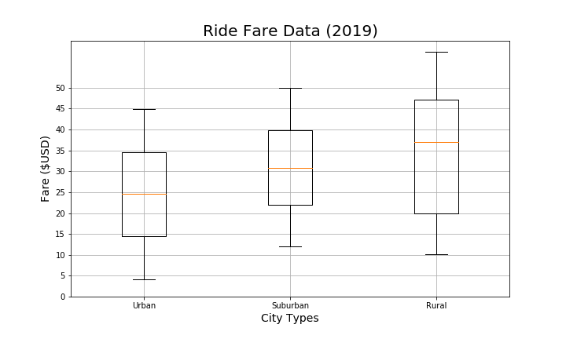

# *PyBer-Analysis with Matplotlib*

## *Introduction*

PyBer is a python based ride sharing app company. The task of this project is to perform exploratory analysis on data in some very large csv files. To aid this process several types of visualizations are created to tell a compelling story about the data. 

Python scripts are written using pandas libraries, a Jupyter notebook and matplotlib to create a variety of charts that showcase the relationship between the type of city and the number of drivers and riders as well as total percentage of fares, rides and drivers by the type of the city. 

The analysis results and the visualizations performed will help the PyBer company improve access to ride sharing services and determine afforabilitly for under-served neighborhoods.

## *Resources*
* Data Sources: city_data.csv and ride_data.csv (present in the resources folder).
* Open-source distribution software Anaconda and the Jupiter notebook.
* Pandas, NumPy, Matpoltlib and SciPy libraries for python.

Both the data sets, city and ride data sets were cleaned by checking if there was any null or missing values in the data sets. After cleaning both the data sets were merged into one data set. The analysis was performed on the merged data set.

## *Results*

A bubble chart that showcases the average fare versus the total number of rides with bubble size based on the average number of drivers of each city type: urban, suburban, and rural was created. The following is the image.

As seen from the bubble chart above that rural areas tend to have a higher average fare and there are few drivers in rural areas as compared to suburban and urban areas. There are few number of drivers in the rural areas and average fare is less in rural areas. The suburban areas lie between rural and urban areas.

The summary statistics were calculated and it was visualized to determine if there are any outliers by using box-and-whisker plots. The box-and-whisker plots for ride count data versus number of rides, ride fare data versus fare and driver count data versus number of drivers were made. The plots are the following.

There is one outlier in the urban ride count data. Also, the average number of rides in the rural cities is about 4- and 3.5-times lower per city than the urban and suburban cities, respectively.

There is no outlier in the ride fare data. The average fare in the rural cities is slightly higher than the urban and suburban cities.

There is no outlier in driver count data. The average number of drivers in the rural cities is about 5-times lower than the urban and suburban cities.

The pie charts for percentage of total fares by city type, percentage of total rides by city type and percentage of total drivers by city type were made. The following are the pie charts.

Urban cities have the highest percentage of fares as compared to suburban and rural cities. Rural cities have the smallest percentage of fares.

Urban cities have the highest percentage of rides as compared to suburban and rural cities. Rural cities have the smallest percentage of rides. 

 Urban cities have a quite high percentage of the number of drivers as compared to suburban and rural cities. Rural cities have the smallest percentage of drivers.

 ## *Challenge Overview*

The CEO of PyBer company wants to see an overall snapshot of the ride-sharing data. In addition to the scatter and pie charts, she would like to see a summary table of key metrics of the ride-sharing data by city type, and a multiple-line graph that shows the average fare for each week by each city type.

## *Results*

The final summary DataFrame for the ride-sharing data is the following:

The multiple-line graph that shows the average fare for each week by each city type is the following.

The multiple-line graph shows that urban cities have the highest fare from January through April 2019, the fare for urban cites ranges from $1700 to $2500. The suburban cities lie in the middle, between urban and rural cites with fare ranging from $700 to $1450. Rural cities have the lowest fare as compared to other areas, the fare ranges from $100 to $500 maximum.
